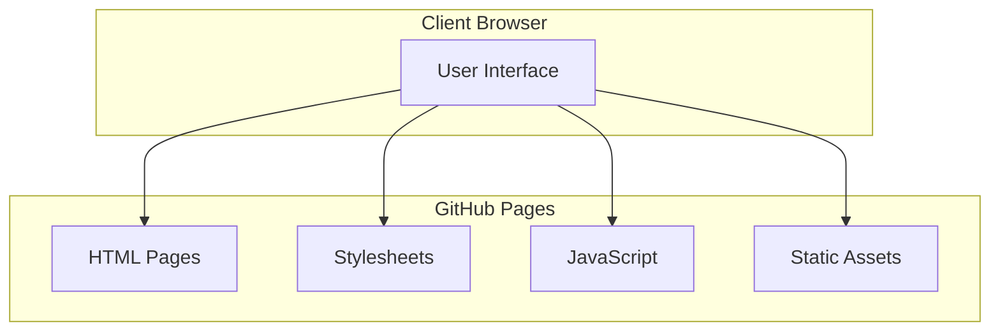
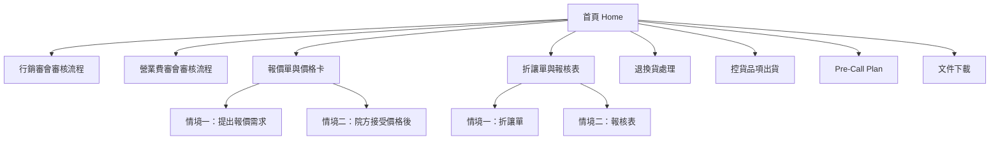
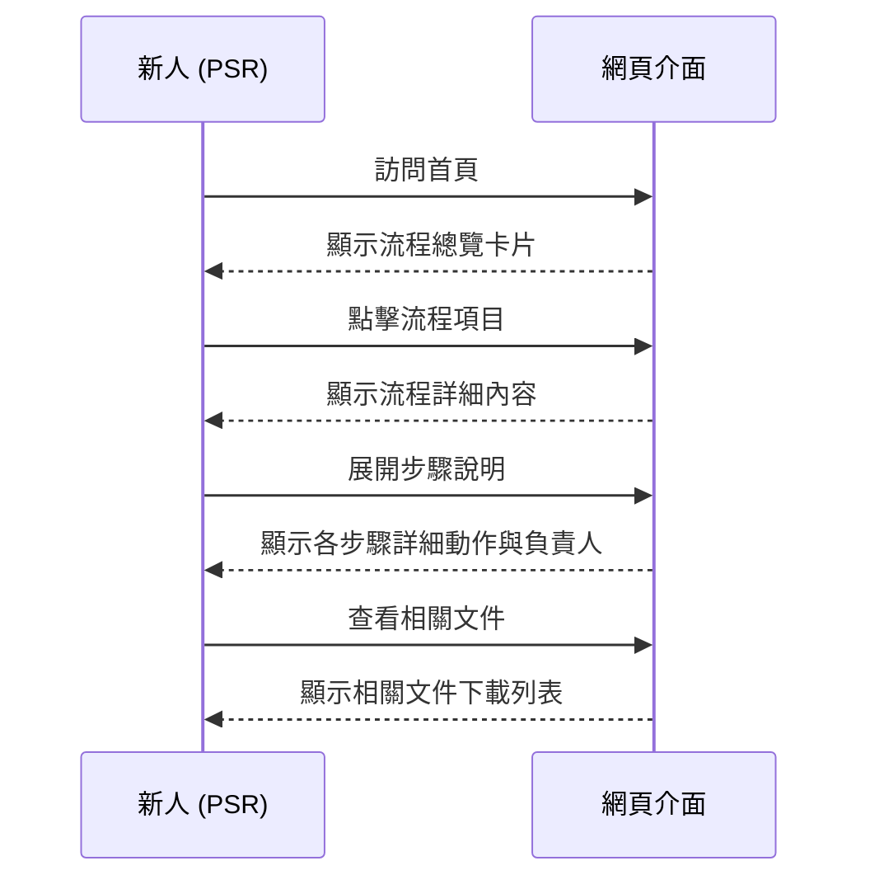
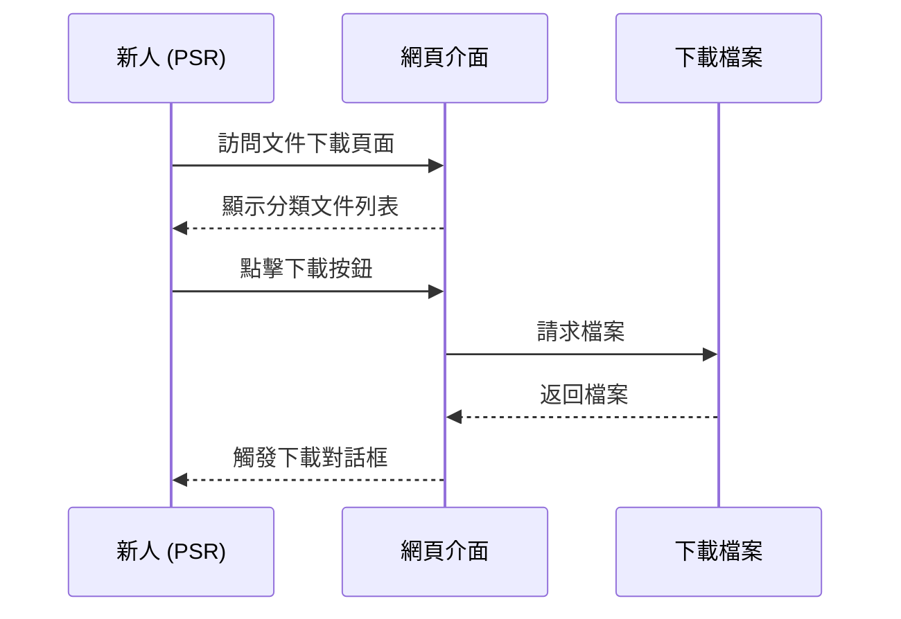

# Design Document: 新人培訓網站 (Onboarding Website)

## Overview

A static website hosted on GitHub Pages designed to help new Product Sales Representatives (PSR) quickly get up to speed with company administrative processes. The site provides interactive process tutorials and document download functionality for 7 key business workflows.

## High-Level Design

### System Architecture



### Technology Stack

- **Hosting**: GitHub Pages
- **Content**: Static HTML/CSS/JavaScript
- **Optional**: Jekyll for markdown support
- **Documentation Format**: Markdown (for easy content maintenance)

### Page Layout Structure

```
+-----------------------------------------------------+
|  Header: Logo + Site Title + Navigation            |
+------------+----------------------------------------+
|            |                                        |
|  Sidebar   |  Main Content Area                    |
|  (Nav)     |  - Process Tutorial Cards             |
|            |  - Step-by-step Instructions          |
|  - Home    |  - Download Links                     |
|  - Process1|                                        |
|  - Process2|                                        |
|  - ...     |                                        |
|  - Downloads|                                       |
|            |                                        |
+------------+----------------------------------------+
|  Footer: Contact Info + Version                    |
+-----------------------------------------------------+
```

### Navigation Structure



## Low-Level Design

### Page Components

#### 1. Home Page (index.html)

```html
<!-- Core Structure -->
<!DOCTYPE html>
<html lang="zh-TW">
<head>
    <meta charset="UTF-8">
    <meta name="viewport" content="width=device-width, initial-scale=1.0">
    <title>新人培訓網站 | PSR Onboarding</title>
    <link rel="stylesheet" href="styles.css">
</head>
<body>
    <header>
        <div class="logo">PSR 新人培訓</div>
        <nav>
            <a href="index.html">首頁</a>
            <a href="processes.html">流程教學</a>
            <a href="downloads.html">文件下載</a>
        </nav>
    </header>
    
    <div class="container">
        <aside class="sidebar">
            <h3>流程目錄</h3>
            <ul>
                <li><a href="#marketing-review">行銷審會審核流程</a></li>
                <li><a href="#expense-review">營業費審會審核流程</a></li>
                <li><a href="#quotation">報價單與價格卡</a></li>
                <li><a href="#discount">折讓單與報核表</a></li>
                <li><a href="#return">退換貨處理</a></li>
                <li><a href="#inventory">控貨品項出貨</a></li>
                <li><a href="#precall">Pre-Call Plan</a></li>
            </ul>
        </aside>
        
        <main class="content">
            <section class="hero">
                <h1>歡迎加入！新人培訓網站</h1>
                <p>本網站提供完整的行政流程教學，幫助您快速上手工作。</p>
            </section>
            
            <section class="process-cards">
                <!-- Process cards will be dynamically or statically generated -->
            </section>
        </main>
    </div>
    
    <footer>
        <p>&copy; 2026 公司名稱 | 聯繫窗口: HR Department</p>
    </footer>
</body>
</html>
```

#### 2. Stylesheet (styles.css)

```css
/* Design System Variables */
:root {
    --primary-color: #2c3e50;
    --secondary-color: #3498db;
    --accent-color: #e74c3c;
    --success-color: #27ae60;
    --warning-color: #f39c12;
    --text-color: #333;
    --light-bg: #f5f6fa;
    --white: #ffffff;
    --border-color: #ddd;
    --shadow: 0 2px 8px rgba(0,0,0,0.1);
    --sidebar-width: 250px;
}

/* Layout */
body {
    font-family: "Microsoft JhengHei", "PingFang TC", sans-serif;
    margin: 0;
    padding: 0;
    color: var(--text-color);
    background: var(--light-bg);
}

.container {
    display: flex;
    min-height: calc(100vh - 120px);
}

.sidebar {
    width: var(--sidebar-width);
    background: var(--white);
    border-right: 1px solid var(--border-color);
    padding: 20px;
    position: sticky;
    top: 0;
    height: 100vh;
    overflow-y: auto;
}

.content {
    flex: 1;
    padding: 30px;
    max-width: 1200px;
}

/* Process Card Component */
.process-card {
    background: var(--white);
    border-radius: 8px;
    padding: 20px;
    margin-bottom: 20px;
    box-shadow: var(--shadow);
    transition: transform 0.2s;
}

.process-card:hover {
    transform: translateY(-3px);
    box-shadow: 0 4px 12px rgba(0,0,0,0.15);
}

.process-card h3 {
    color: var(--primary-color);
    margin-top: 0;
}

/* Flow Diagram Styling */
.flow-diagram {
    display: flex;
    flex-wrap: wrap;
    align-items: center;
    gap: 10px;
    padding: 20px;
    background: var(--light-bg);
    border-radius: 8px;
    margin: 15px 0;
}

.flow-step {
    background: var(--secondary-color);
    color: var(--white);
    padding: 10px 20px;
    border-radius: 20px;
    font-weight: 500;
}

.flow-arrow {
    color: var(--primary-color);
    font-size: 1.5em;
}

.flow-step.paper {
    background: var(--warning-color);
}

/* Download List */
.download-list {
    list-style: none;
    padding: 0;
}

.download-item {
    display: flex;
    align-items: center;
    padding: 15px;
    background: var(--white);
    border: 1px solid var(--border-color);
    margin-bottom: 10px;
    border-radius: 6px;
}

.download-item .file-icon {
    font-size: 2em;
    margin-right: 15px;
    color: var(--secondary-color);
}

.download-item .file-info {
    flex: 1;
}

.download-item .download-btn {
    background: var(--success-color);
    color: var(--white);
    padding: 8px 16px;
    border-radius: 4px;
    text-decoration: none;
    transition: background 0.2s;
}

.download-item .download-btn:hover {
    background: #219a52;
}

/* Responsive */
@media (max-width: 768px) {
    .container {
        flex-direction: column;
    }
    
    .sidebar {
        width: 100%;
        height: auto;
        position: relative;
        border-right: none;
        border-bottom: 1px solid var(--border-color);
    }
    
    .flow-diagram {
        flex-direction: column;
    }
    
    .flow-arrow {
        transform: rotate(90deg);
    }
}
```

### Data Structures

#### Process Metadata Structure

```typescript
interface Process {
    id: string;                    // Unique identifier
    title: string;                 // Process name (zh-TW)
    titleEn: string;               // English title (optional)
    description: string;           // Brief description
    scenarios?: Scenario[];        // Multiple scenarios if applicable
    flow: FlowStep[];              // Sequential flow steps
    paperFlow?: FlowStep[];        // Physical document flow (if separate)
    relatedDocuments: string[];    // Related document IDs
    responsibleRoles: string[];    // PSR, Supervisor, Champion, etc.
    notes?: string[];              // Additional notes/tips
}

interface Scenario {
    id: string;
    title: string;
    description: string;
    flow: FlowStep[];
}

interface FlowStep {
    order: number;
    actor: string;                 // Who performs this action
    action: string;                // What action is taken
    description?: string;          // Optional detailed description
}
```

#### Document Catalog Structure

```typescript
interface Document {
    id: string;
    name: string;                  // Display name (zh-TW)
    filename: string;              // Actual file name
    category: DocumentCategory;    // Category enum
    description?: string;          // Brief description
    relatedProcesses?: string[];   // Process IDs this document relates to
}

enum DocumentCategory {
    EXPENSE = "expense",           // 日常報支
    EVENT = "event",               // 活動申請
    ADMIN = "admin",               // 行政文書
    TEMPLATE = "template"          // 通用模板
}
```

### Interactive Features

#### Process Flow Visualization

```javascript
// renderProcessFlow function
function renderProcessFlow(process) {
    const flowContainer = document.getElementById(`flow-${process.id}`);
    
    process.flow.forEach((step, index) => {
        const stepEl = document.createElement('div');
        stepEl.className = 'flow-step';
        stepEl.textContent = `${step.order}. ${step.actor}: ${step.action}`;
        flowContainer.appendChild(stepEl);
        
        if (index < process.flow.length - 1) {
            const arrowEl = document.createElement('div');
            arrowEl.className = 'flow-arrow';
            arrowEl.textContent = '→';
            flowContainer.appendChild(arrowEl);
        }
    });
}
```

#### Document Download Handler

```javascript
// downloadDocument function
function downloadDocument(docId) {
    const doc = documentCatalog.find(d => d.id === docId);
    if (!doc) {
        console.error('Document not found:', docId);
        return;
    }
    
    // Track download analytics (optional)
    if (typeof gtag !== 'undefined') {
        gtag('event', 'download', {
            event_category: 'document',
            event_label: doc.name
        });
    }
    
    // Trigger download
    const link = document.createElement('a');
    link.href = `./downloads/${doc.filename}`;
    link.download = doc.filename;
    link.click();
}
```

### Process Content Specification

#### Process 1: 行銷審會審核流程

```javascript
const marketingReviewProcess = {
    id: "marketing-review",
    title: "行銷審會審核流程",
    description: "活動費用申請的審核流程，從 PSR 準備資料到 Champion 審核完成",
    flow: [
        { order: 1, actor: "PSR", action: "準備資料", description: "準備付款憑單與相關單據掃描檔" },
        { order: 2, actor: "主管", action: "審核", description: "送直屬主管審核" },
        { order: 3, actor: "PM", action: "審核", description: "送 PM 審核" },
        { order: 4, actor: "Jerry/Bernie", action: "審核", description: "送 Jerry 或 Bernie 審核" },
        { order: 5, actor: "Champion", action: "審核", description: "送 Champion 最終審核" }
    ],
    paperFlow: [
        { order: 1, actor: "PSR", action: "提交紙本", description: "紙本資料交給 Joanne" }
    ],
    notes: [
        "付款憑單與相關單據需先掃描提供給主管",
        "紙本資料交給 Joanne 留存"
    ],
    responsibleRoles: ["PSR", "主管", "PM", "Champion", "Joanne"],
    relatedDocuments: ["付款憑單", "活動後付款憑單", "簽到表", "議程"]
};
```

#### Process 2: 營業費審會審核流程

```javascript
const expenseReviewProcess = {
    id: "expense-review",
    title: "營業費審會審核流程",
    description: "營業費用申請的審核流程，需先確認費審編號",
    flow: [
        { order: 1, actor: "PSR", action: "準備資料", description: "確認費審編號，準備付款憑單與單據" },
        { order: 2, actor: "主管", action: "審核", description: "送直屬主管審核" },
        { order: 3, actor: "Champion", action: "審核", description: "送 Champion 審核" }
    ],
    paperFlow: [
        { order: 1, actor: "PSR", action: "提交紙本", description: "紙本資料交給 Anita" }
    ],
    notes: [
        "需先向主管確認欲申請的費審編號",
        "付款憑單與相關單據掃描後，提供給主管與 Champion",
        "紙本資料交給 Anita 留存"
    ],
    responsibleRoles: ["PSR", "主管", "Champion", "Anita"],
    relatedDocuments: ["付款憑單", "月結表"]
};
```

#### Process 3: 報價單與價格卡

```javascript
const quotationProcess = {
    id: "quotation",
    title: "報價單與價格卡",
    description: "報價申請與價格卡建立的完整流程",
    scenarios: [
        {
            id: "quote-request",
            title: "情境一：提出報價需求",
            description: "當需要向醫院提出報價時的流程",
            flow: [
                { order: 1, actor: "PSR", action: "取得授權", description: "提出需求並取得授權" },
                { order: 2, actor: "PSR", action: "填寫報價單", description: "填寫報價單" },
                { order: 3, actor: "PSR", action: "填寫用印申請單", description: "填寫用印申請單" },
                { order: 4, actor: "主管", action: "審核", description: "送主管審核" },
                { order: 5, actor: "Champion", action: "審核", description: "送 Champion 審核" },
                { order: 6, actor: "Anita", action: "協助用印", description: "交由 Anita 協助用印" }
            ]
        },
        {
            id: "price-confirmation",
            title: "情境二：院方接受價格後",
            description: "當醫院接受報價後建立價格的流程",
            flow: [
                { order: 1, actor: "PSR", action: "建立價格", description: "於公司系統建立價格" },
                { order: 2, actor: "PSR", action: "填寫特惠價格卡", description: "填寫特惠價格卡" },
                { order: 3, actor: "主管", action: "審核", description: "送主管審核" },
                { order: 4, actor: "Champion", action: "審核", description: "送 Champion 審核" }
            ]
        }
    ],
    responsibleRoles: ["PSR", "主管", "Champion", "Anita"],
    relatedDocuments: ["報價單", "用印申請單", "特惠價格卡"]
};
```

#### Process 4: 折讓單與報核表

```javascript
const discountProcess = {
    id: "discount",
    title: "折讓單與報核表",
    description: "退換貨相關的折讓單處理與報核表申請",
    scenarios: [
        {
            id: "discount-note",
            title: "情境一：折讓單",
            description: "處理退貨或價格調整時的折讓單流程",
            flow: [
                { order: 1, actor: "PSR", action: "填寫折讓單", description: "填寫折讓單" },
                { order: 2, actor: "醫院採購", action: "蓋章", description: "交由醫院採購蓋章" },
                { order: 3, actor: "PSR", action: "收回回執聯", description: "收回回執聯" },
                { order: 4, actor: "Anita", action: "留存", description: "交給 Anita 留存" }
            ]
        },
        {
            id: "approval-form",
            title: "情境二：報核表",
            description: "申請價格調整核可的報核表流程",
            flow: [
                { order: 1, actor: "PSR", action: "填寫報核表", description: "填寫報核表" },
                { order: 2, actor: "PSR", action: "附上折讓單", description: "附上折讓單掃描檔" },
                { order: 3, actor: "主管", action: "審核", description: "送主管審核" },
                { order: 4, actor: "Champion", action: "審核", description: "送 Champion 審核" }
            ]
        }
    ],
    responsibleRoles: ["PSR", "主管", "Champion", "Anita"],
    relatedDocuments: ["折讓單", "報核表"]
};
```

#### Process 5: 退換貨處理

```javascript
const returnProcess = {
    id: "return",
    title: "退換貨處理",
    description: "產品退換貨的申請與處理流程",
    flow: [
        { order: 1, actor: "PSR", action: "提出需求", description: "提出退換貨需求" },
        { order: 2, actor: "PSR", action: "取得授權", description: "取得授權後填寫退換貨處理單" },
        { order: 3, actor: "主管", action: "審核", description: "送主管審核" },
        { order: 4, actor: "Champion", action: "審核", description: "送 Champion 審核" },
        { order: 5, actor: "Anita", action: "安排物流", description: "由 Anita 安排物流退換貨" }
    ],
    responsibleRoles: ["PSR", "主管", "Champion", "Anita"],
    relatedDocuments: ["退換貨處理單"]
};
```

#### Process 6: 控貨品項出貨

```javascript
const inventoryProcess = {
    id: "inventory",
    title: "控貨品項出貨",
    description: "醫院庫存控管品項的出貨申請流程",
    flow: [
        { order: 1, actor: "PSR", action: "詢問庫存", description: "先詢問院方庫存量" },
        { order: 2, actor: "PSR", action: "評估出貨", description: "評估是否需要出貨" },
        { order: 3, actor: "PSR", action: "提出申請", description: "須於當日 15:00 前提出" },
        { order: 4, actor: "主管", action: "審核", description: "送主管審核" },
        { order: 5, actor: "Champion/PM", action: "確認", description: "視品項與狀況，送 Champion 或 PM 確認" }
    ],
    notes: [
        "須於當日 15:00 前提出申請",
        "根據品項可能需要 Champion 或 PM 確認"
    ],
    responsibleRoles: ["PSR", "主管", "Champion", "PM"],
    relatedDocuments: []
};
```

#### Process 7: Pre-Call Plan

```javascript
const precallProcess = {
    id: "precall",
    title: "Pre-Call Plan",
    description: "拜訪前計劃的準備與提交流程",
    flow: [
        { order: 1, actor: "PSR", action: "完成 Pre-Call Plan", description: "最晚需於 Coaching 前一週完成" },
        { order: 2, actor: "主管", action: "提供給主管", description: "完成後提供給主管" },
        { order: 3, actor: "Champion", action: "副本給 Champion", description: "同步副本給 Champion" }
    ],
    notes: [
        "最晚需於 Coaching 前一週完成",
        "需要同步副本給 Champion"
    ],
    responsibleRoles: ["PSR", "主管", "Champion"],
    relatedDocuments: ["Pre-Call Plan 模板"]
};
```

### Document Catalog

```javascript
const documentCatalog = [
    // 日常報支與月結報表
    { id: "expense-monthly", name: "月結表", filename: "[範本]_expense_月結表.xlsx", category: "expense", description: "每月費用月結統計表" },
    { id: "expense-payment", name: "付款憑證", filename: "[範本]_PMS_付款憑證.xlsx", category: "expense", description: "付款憑證申請表" },
    { id: "expense-service", name: "勞務費模板", filename: "[範本]_勞務費_模板.docx", category: "expense", description: "醫師勞務費申請模板" },
    { id: "expense-report", name: "報核表", filename: "[範本]_報核表.doc", category: "expense", description: "費用報核申請表" },
    { id: "expense-discount", name: "折讓單", filename: "[範本]_折讓單.xls", category: "expense", description: "價格折讓單模板" },
    { id: "expense-speech", name: "演講費收據", filename: "[範本]_演講費收據_模板.docx", category: "expense", description: "演講費收據模板" },
    
    // 活動模板
    { id: "event-agenda", name: "Agenda", filename: "Agenda.xlsx", category: "event", description: "活動議程模板" },
    { id: "event-benefit", name: "效益預估", filename: "效益預估_空白.xlsx", category: "event", description: "活動效益預估表" },
    { id: "event-expense-photo", name: "活動後付款憑單&照片", filename: "活動後付款憑單&照片.xlsx", category: "event", description: "活動結束後的付款申請" },
    { id: "event-signin", name: "簽到表", filename: "簽到表.xlsx", category: "event", description: "活動簽到表" },
    
    // 行政文書
    { id: "admin-quotation", name: "報價單範例", filename: "報價單-耕莘台北 20260401健保調降(EDB-SMN)-20250422.xls", category: "admin", description: "報價單填寫範例" },
    { id: "admin-approval-form", name: "報核表範本", filename: "報核表_範本_2026.docx", category: "admin", description: "報核表填寫範本" },
    { id: "admin-discount-example", name: "折讓單範例", filename: "北慈-UTB+舒服平(退貨)-折讓單.xls", category: "admin", description: "折讓單填寫範例" },
    { id: "admin-seal-application", name: "用印申請範例", filename: "用印申請單__耕莘台北健保調降報價單_0422_George.doc", category: "admin", description: "用印申請單範例" },
    
    // 勞務與演講
    { id: "labor-receipt", name: "勞務費請款領據", filename: "勞務費請款領據_原始模板.docx", category: "template", description: "醫師勞務費請款領據" },
    { id: "speech-receipt", name: "演講費收據", filename: "演講費收據_原始模板.docx", category: "template", description: "演講費收據" },
    
    // 週期性報表
    { id: "report-monthly", name: "月度營運會議報告", filename: "MOR月度營運會議報告_示範結構.pptx", category: "template", description: "月度會議報告範本" },
    { id: "report-market", name: "每月市場訊息彙整", filename: "每月市場訊息彙整_範本.xlsx", category: "template", description: "市場訊息彙整模板" },
    { id: "report-weekly", name: "週行程規劃", filename: "週行程規劃_範本.xlsx", category: "template", description: "每週行程規劃模板" }
];
```

## User Interaction Flows

### Process Tutorial Flow



### Document Download Flow



## File Structure

```
onboarding-website/
├── index.html              # 首頁
├── processes.html          # 流程教學總覽頁
├── process-detail.html     # 流程詳細內容頁（使用 URL 參數）
├── downloads.html          # 文件下載頁面
├── styles/
│   └── styles.css          # 主樣式表
├── scripts/
│   ├── data.js             # 流程與文件資料
│   └── main.js             # 主要互動邏輯
├── downloads/              # 下載檔案目錄
│   ├── [範本]_expense_月結表.xlsx
│   ├── [範本]_PMS_付款憑證.xlsx
│   └── ... (其他模板檔案)
└── assets/
    └── images/             # 圖片資源
```

## Accessibility Considerations

- 使用 Semantic HTML 結構
- 確保 sufficient color contrast (WCAG AA)
- 為所有圖片提供 alt 文字
- 支援鍵盤導航
- 使用 ARIA 標籤標識互動元素

## Responsive Design

- Desktop: 完整側邊欄 + 內容區域
- Tablet: 可折疊側邊欄
- Mobile: 垂直堆疊布局，漢堡選單導航